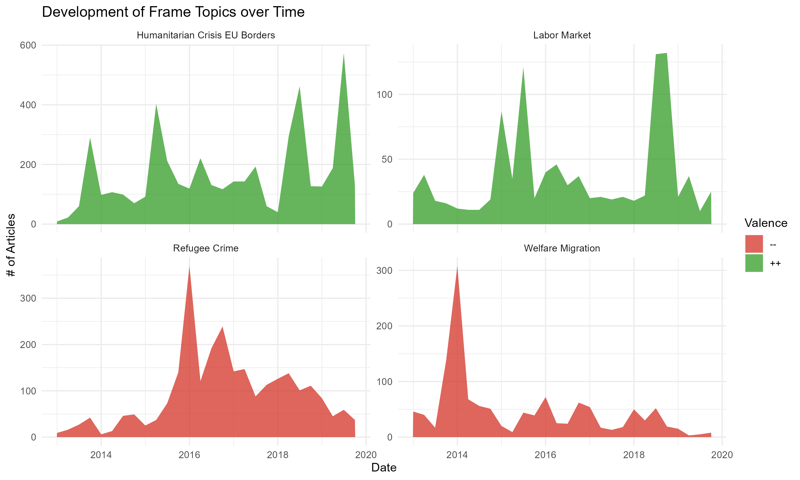

# Frame Competition



Issue ownership theory assumes that the salience of specific issues is always more or less beneficial to a given party. I introduce the concept of "frame competition" and argue that a given issue can be more or less beneficial for parties dependent on the dominant framing. I test this argument using data from the German 2017 election campaign, assessing the similarity of media coverage on migration to the parties' migration framing with topic vectors. Using VAR models, I show whether higher frame similarity is associated with better performance in the polls. The findings broaden our understanding party competition and show parties' capability to compete when the issue agenda is given.

## Structure of Code

```{txt}
/code
    |___/collection
        |___polls.R
            # collection of polling data from Politico's PollOfPolls
            ISSUES:
                move poll plot to own file
            output:
                # plot of polls
                    "plots/descriptives/polls.png"
                # polling data
                    "data/processed/polls.csv"
    |___/estimation
        |___granger.r
                # Granger causality checks media <-> polls
                ISSUES:
                    currently unclear if used
                    might use first differences instead
                input:
                    # media data
                        "data/processed/media/merged.csv"
                output:
                    # results of granger tests for different aggregation levels
                        "data/processed/media/granger_daily.csv"
                        "data/processed/media/granger_weekly.csv"
        |___ols.r
            # estimate simple ols
                ISSUES:
                    move data prep in single file to generate weekly estimates of polls, valence, topic and migration salience
                    outlier removal could be simplified by replacing all -3SD > obs < 3SD
                input:
                    # topic estimates
                        "data/processed/media/docs_topics_sims.csv"
                    # polls
                        "data/raw/polls/polls.csv"
                output:
                    # OLS Models
                        "models/ols"
        |___iv.r
                # instrument mediterranean coverage with month
                ISSUES:
                    exclusion restriction violated
                    might rerun with data from IOM https://missingmigrants.iom.int/data
                    no output currently
                input:
                    "data/processed/media/merged.csv"
        |___topic_var.r
                # run var for all party-topic combinations
                functions:
                    "code/functions/var_topic.r"
                input:
                    "data/processed/media/merged.csv"
                ouput:
                    # VAR results
                        "data/processed/estimation/var_results_weekly.csv"
    |___/functions
        |___RDDplots.r
                # estimate and plot RDDs for media and polling data
                inputs:
                    Polls
                        "data/processed/polls.csv"
                    Media Estimates
                        "data/processed/media/full_ests.csv"
        |___var_topic.r
                # estimate var model poll ~ topic
                input:
                    # media and polling data
                        "data/processed/media/merged.csv"
    |___/measurement
        |___dict_ext.py
                # embedding extension of dictionaries
                input:
                    # 
                    "data/raw/embeddings/np_embs/np_emb"
                    "data/raw/dicts/"
                output:
                    "data/processed/dicts/"
        |___dicts_count.r
            # count prevalence of dictionaries
            inputs:
                # dictionaries
                    "data/processed/dicts"
                # media texts
                    "data/raw/media/bert_crime_clean.csv"
                # topic similarities
                    "data/processed/media/docs_topics_sims.csv"
            output:
                # full media data including dicts
                    "data/processed/media/full_ests.csv"
    |___/preprocessing
        |___merging.r
            # merging polling and topic data
            ISSUES:
                output should be moved to output folder
            inputs:
                # topics
                    "data/processed/media/full_ests.csv"
                # polls
                    "data/raw/polls/polls.csv"
            outputs:
                # merged data
                    "data/processed/media/merged.csv"
        |___news_sampling.r
            ISSUES:
                DROP before handing in
            # sample for testing
            input:
                "data/processed/media/news_merged.csv"
            output:
                "data/processed/media/news_merged_sample.csv"
        |___preprocess_news.R
            ISSUES:
                DROP output not used, code uses output from bert project
            # Fix dates in raw news data
            input:
                "data/raw/media/newspapers"
            output:
                "data/processed/media/news_merged.csv"
    |___/vis
        |___descriptives.R
            # plot descriptives of topic distribution
            ISSUES:
                move valence annotation topic labelling or own file
                should use final output file
            input:
                # media data
                    "data/processed/media/docs_topics_sims.csv"
                # topic overview
                    "data/processed/media/topic_table.csv"
            output:
                # media data with valence
                    "data/processed/media/docs_topics_sims.csv"
                # plots
                    "plots/Descriptives/valence_over_time.png"
                    "plots/Descriptives/topics_over_time.png"
        |___est_corr.r
            # visualise validation of estimates
            inputs:
                "data/processed/media/full_ests.csv"
            outputs:
                # plot of different crime estimates over time
                    "plots/crime_estimates.png"
                    "plots/crime_estimates_pres.png"
                # correlation matrices of estimates
                    "plots/crime_est_cor_doclevel.png"
                    "plots/crime_est_cor_monthly.png"
        |___rdd.r
            # rdd estimates for event effects on party share
            ISSUES:
                drop unnecessary code
            functions:
                "code/functions/RDDPlots.R"
            inputs:
                # poll data
                    "data/processed/polls.csv"
            outputs:
                # media and poll change for different events
                    "plots/RDD/MediaEffect_cologne.png"
                    "plots/RDD/PollEffect_cologne.png"
                    "plots/RDD/MediaEffect_cologne_rep.png"
                    "plots/RDD/PollEffect_cologne_rep.png"
                    "plots/RDD/MediaEffect_lampedusa_med.png"
                    "plots/RDD/MediaEffect_lampedusa_ht.png"
                    "plots/RDD/PollEffect_lampedusa.png"
                    "plots/RDD/MediaEffect_luebcke.png"
                    "plots/RDD/PollEffect_luebcke.png"
                    "plots/RDD/polls_greens_luebcke.png"
                    "plots/RDD/MediaEffect_csu_campaign.png"
                    "plots/RDD/PollEffect_csu_campaign.png"
                    "plots/RDD/MediaEffect_parndorf_ht.png"
                    "plots/RDD/PollEffect_parndorf.png"
                    "plots/RDD/MediaEffect_parndorf_med.png"
                    "plots/RDD/MediaEffect_breitscheidt.png"
                    "plots/RDD/PollEffect_breitscheidt.png"
                    "plots/RDD/PollEffect_ep.png"
                    "plots/RDD/PollEffect_luebcke_corrected.png"
                    "plots/RDD/MediaEffect_calais.png"
                    "plots/RDD/PollEffect_calais.png"
        |___var_vis.r
                # visualise VAR results
                input:
                    # var results
                        "data/processed/estimation/var_results_weekly.csv"
                output:
                    "plots/var/top_topics_weekly.png"
                    "plots/var/top_dicts_weekly.png"
                    "plots/var/[PARTY]_topics_weekly.png"
                    "plots/var/[PARTY]_topics_dv_weekly.png"
                    "plots/var/salience_weekly.png"
                    "plots/descriptives/topics_weekly.png"


```
